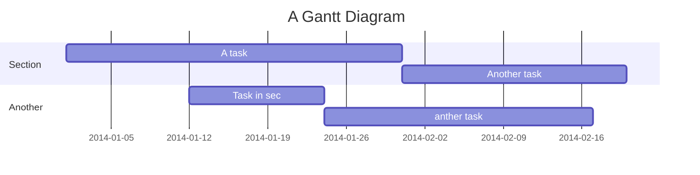

Filecoin CID checker SRS
===
Link: https://hackmd.io/RMpGnE3YQm607jl0QevCoQ?view
## Table of Contents

[TOC]

## Beginners Guide 

If you are a total beginner to this, start here!

1. Visit the website
2. Click "Sign in"
3. Choose a way to sign in
4. Enter your file CID

User story
---

```gherkin=
Feature: User authorization 

  # Creating a new User record
  Scenario: User creates a Username and a Password
    When the User enters a Username and a Password
    Then the CA creates a new user record

  # User login
  Scenario: Check the Username and the Password
    Given the User has entered the Username and the Password
    When the CA checks the User credentials
    Then the User obtains access to the webapp
```
> 

```gherkin=
Feature: list the User's CIDs and related info
  As a User I want to see 1 long table listing my CIDs and:
1. miners storing this CID
2. sectors they are storing
3. state as a colored indicator:
green - good | grey - capacity | red - failing


Scenario: User 
    Given Condition
    When Action1
    And Action2
    Then Result1
    And Result2
    And Result3
```

> 

User flows (in progress)
---
```sequence
User->APP: Userneme+Password
Note right of APP: CA checks records
APP-->User: Hello, User! Enter the CID
User->APP: copy-past the CID
Note right of APP: indexing the data by the CID
APP->User: See the Table!
```

> 

Project Timeline (in progress)
---


> 

## Appendix and FAQ

:::info
**Find this document incomplete?** Leave a comment!
:::

###### tags: `Templates` `Documentation`
